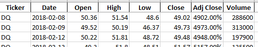
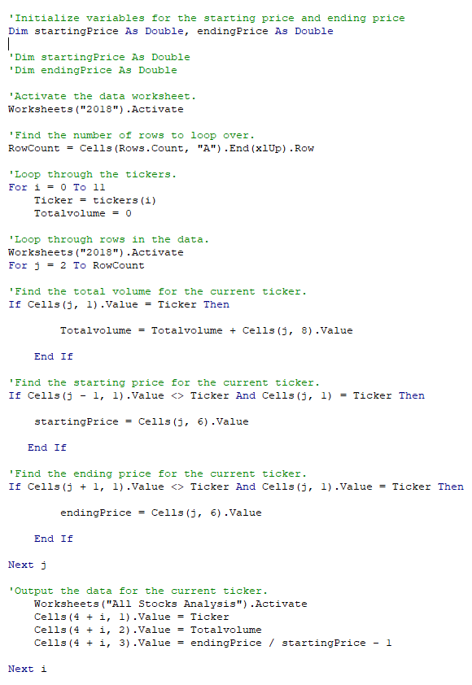
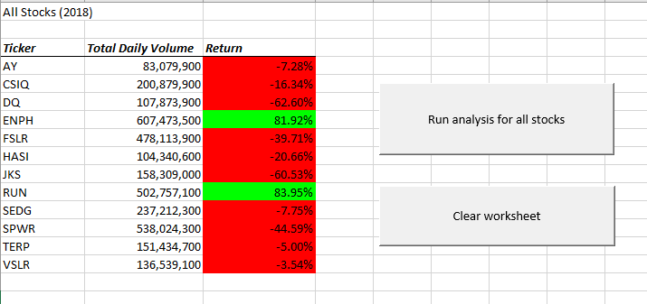
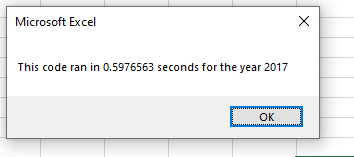
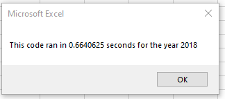
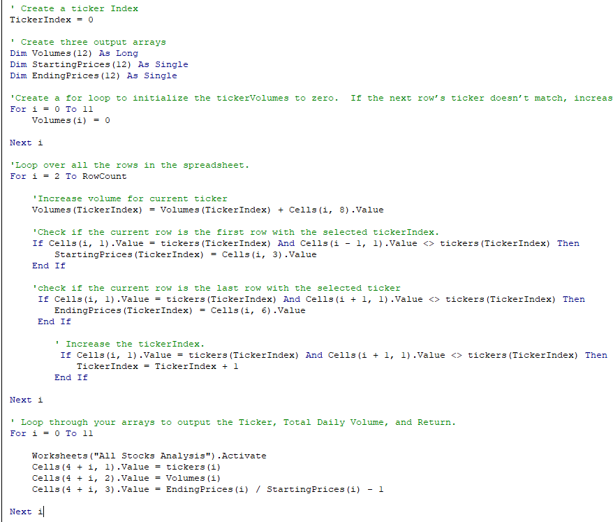
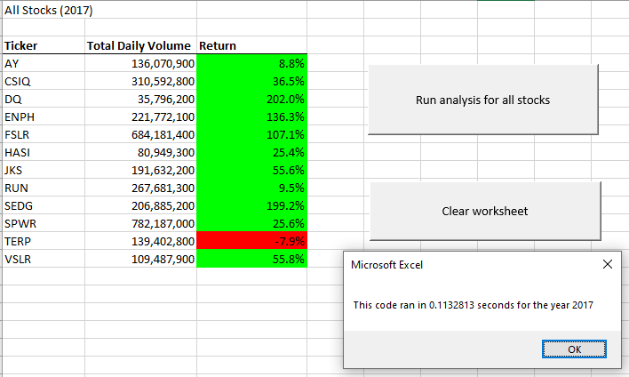
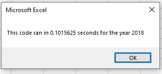

# **Stock-Analysis with VBA**

## **Overview of Project**

##### As VBA is often used in the financial industry, I used nested loops in VBA to analyze alternative energy stocks and automate the calculations. My objective was to find out if the manufacturer of silicon wafer panels, DAQO(DQ) is a good investment choice for my friend's parents. After running my analysis, I refactored the code to make it more efficient. 
---
## **Results**

##### I used data from  12 stocks to analyze their starting price, ending price and volume to calculate the return. 

##### In my original code, I looped through each row and each ticker to find the starting price, ending price and volume. Then output results on a table on a separate sheet.  

    

##### In my refactored code, I created and looped through arrays to find the starting price, ending price and volume. Then output results on a table on a separate sheet.  
 

    

---
## **Summary**

##### Refactoring code is the process of taking existing code and editing it without changing the function of the code.  Refactoring is useful and sometimes necessary to clean up the original code to make it more efficient to use in the future.   There are also disadvantages to refactoring code. In my case, after I refactored my code to analyse the stocks, I found many mistakes and errors.  It took a lot of time and testing. After refactoring the code, I noticed the code took less time to run.  
##### **Advantages**
- ##### Make it easier to understand for the next developer to use
- ##### Create a faster and better quality code that is more maintainable, in case you want to add to it. 
- ##### Calculations may take less time to run 
 
##### **Disadvantages**
- ##### The time it takes to retest functionality after editing the code
- ##### After editing the code, bugs may be in the new code

